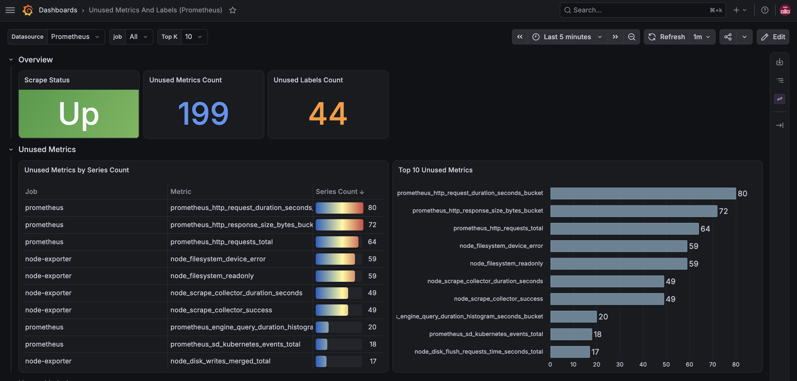

# sigprune-exporter

**sigprune** *(n.)* — *"Signal Pruner"*. A Prometheus exporter for detecting unused metrics and labels within a Grafana datasource.

A metric/label is deemed 'unused' if:
- it does not appear in any Grafana Dashboard
- it does not appear in any Grafana Alert Rule

The exporter allows you to visualize these unused metrics and labels in a Grafana dashboard like the one below:



A sample dashboard is included in `docker/grafana/provisioning/dashboards/sigprune.json` and is automatically provisioned when using the local Docker stack.


*Note: Currently, the exporter only supports Prometheus datasources*


## Installation

**Requires** [Go](https://go.dev/dl/) 1.21+

```bash
git clone https://github.com/parthivrmenon/sigprune-exporter.git
cd sigprune-exporter
go build \
  -ldflags "-X main.buildVersion=v1.0.0 -X main.buildRevision=$(git rev-parse --short HEAD)" \
  -o sigprune-exporter .
```

This produces a `sigprune-exporter` binary in the current directory. The `buildVersion` and `buildRevision` flags are injected at build time and exposed via the `sigprune_build_info` metric.

```bash
./sigprune-exporter --help
```

## Configuration

| Argument | Description | Default |
|---|---|---|
| `-grafanaURL` | Grafana URL | `http://localhost:3000` |
| `-user` | Username for basic auth | |
| `-password` | Password for basic auth | |
| `-api-key` | Grafana API key for authentication | |
| `-datasource` | Prometheus datasource UID to collect metrics from | *(required)* |
| `-listen-address` | Address to listen on for HTTP requests | `:8080` |
| `-tsdb-metrics-limit` | Number of top metrics to analyze from TSDB status | `10000` |
| `-metrics-limit` | Limit the number of unused metrics to export | `50` |
| `-labels-limit` | Limit the number of unused labels to export | `10` |

> **Note:** 
> - Increasing `labels-limit` increases scrape latency linearly — each additional label adds one sequential Prometheus API call to fetch per-job series counts.


## Usage

**Basic auth:**
```bash
./sigprune-exporter \
  --user admin \
  --password admin \
  --datasource <prometheus-datasource-uid>
```

**API key:**
```bash
./sigprune-exporter \
  --api-key <grafana-api-key> \
  --datasource <prometheus-datasource-uid>
```

Once running, metrics are available at `http://localhost:8080/metrics`.

The Prometheus datasource UID can be found in Grafana under **Connections → Data sources → (your datasource) → Settings**.


## Metrics Reference

| Metric | Type | Labels | Description |
|---|---|---|---|
| `sigprune_build_info` | Gauge | `version`, `revision` | Always `1`. Exposes build version and git revision of the running binary |
| `sigprune_up` | Gauge | — | `1` if the last Grafana scrape succeeded, `0` if it failed |
| `sigprune_unused_metric_cardinality` | Gauge | `job`, `metric` | Series count of a top-K unused metric (not referenced in any dashboard or alert rule) |
| `sigprune_unused_label_cardinality` | Gauge | `job`, `label` | Series count of a top-K unused label (not referenced in any dashboard or alert rule) |
